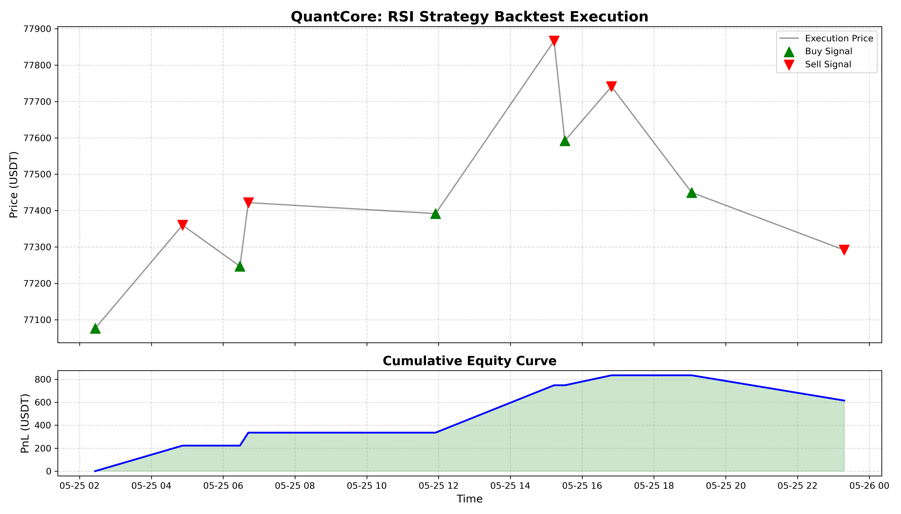
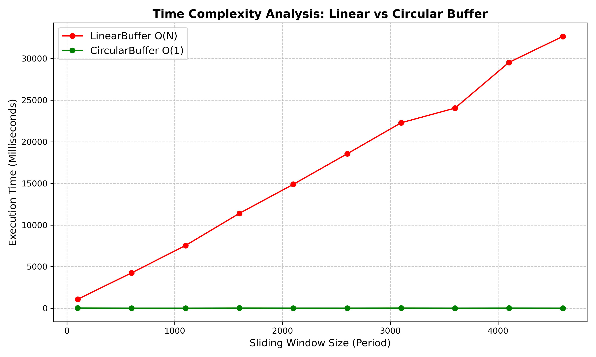

# QuantCore: 高效能歷史股價回測系統與資料結構優化實作

## 動機與目標
在量化交易領域，處理百萬級別的交易明細（Tick Data）時，系統效能直接受制於底層資料結構的設計。若使用未經優化的線性結構，滑動視窗運算（Sliding Window）將導致 $O(N \times W)$ 的計算成本，在面對高頻數據時會產生嚴重的執行延遲。

本專案旨在運用 C++ 實作一套回測引擎，核心目標在於量化不同資料結構在金融運算中的效能差異。透過實作「環形緩衝區（Circular Buffer）」與「雜湊表（Hash Table）」等結構，驗證其在降低 CPU 運算時間與記憶體存取延遲上的實際貢獻。資料來源選用 investing.com ，並以台積電的價格數據做為初始樣本。關於複雜度驗證，本專案將明確量化 $O(1)$ 與 $O(N)$ 結構在不同資料規模下的執行耗時差異。

## 競品比較
| 特性 | 現有開源框架 (如 Backtrader, Zipline) | QuantCore (本專案) |
| :--- | :--- | :--- |
| **開發語言** | 主要為 Python | **C++ (核心引擎)** |
| **執行效率** | 易受 GIL 限制，大規模回測較慢 | **硬體友善，支援指標運算優化** |
| **資料結構** | 多層次封裝物件，記憶體開銷大 | **自定義結構，預配置記憶體** |
| **複雜度控制** | 為了通用性，常犧牲特定場景效能 | **針對滑動視窗進行 $O(1)$ 優化** |

## 預期功能
* **Milestone 1: 數據底層與快取架構 (Data Foundation)**
    * 實作自定義 CSV 解析器，支援讀取 Yahoo Finance 格式之歷史日線資料（約 $10^4$ 筆交易紀錄）。
    * 設計 `StockData` 記憶體對齊，確保時序資料讀取時能最大化 Cache Locality。
* **Milestone 2: 計算引擎效能實驗 (Computation Benchmark)**
    * 同時實作「線性掃描」與「環形緩衝區」指標計算模組。
    * 產出在不同數據量（$10^4$ 至 $10^7$）下的效能報告，驗證 $O(W) \rightarrow O(1)$ 的理論優勢。
* **Milestone 3: 狀態機與檢索優化 (OMS & Retrieval)**
    * 實作基於 Hash Table 的多標的持倉管理系統，達成資產狀態 $O(1)$ 查詢。
    * 實作 AVL Tree 交易日誌系統，支援歷史紀錄的 $O(\log N)$ 區間檢索（Range Query）。
* **Milestone 4: 壓力測試與總結 (Stress Test & Reporting)**
    * 模擬極端高頻交易環境，對比 C++ 實作與現有 Python 框架的執行速差。
    * 量化分析資料結構選擇對系統擴展性（Scalability）的具體影響。

## 使用技術
* **核心開發**：C++ 17/20 (負責邏輯計算、手動記憶體管理、底層指標優化)。
* **資料結構實作**：
    * **Circular Buffer**：優化滑動視窗指標（MA, RSI）運算。
    * **Hash Table**：加速多標的部位檢索。
    * **Balanced BST (AVL Tree)**：管理具時間序列特性的交易日誌。
* **輔助工具**：Git / GitHub (版本控制)、Python (僅用於效能數據視覺化)。
 
## Prototype 預計可驗證內容
* **複雜度拐點分析**：觀測當運算視窗大小 $W$ 增加時，環形緩衝區與線性掃描在執行時間上的數量級差距。
* **資料量擴展性測試**：驗證當資料量從 $10^4$ 提升至 $10^7$ 筆時，系統吞吐量（Throughput）是否符合預期複雜度曲線。
* **Cache Miss 影響**：對比連續記憶體與節點式結構在處理大規模數據時，硬體緩存對執行效率的實際干預。

--

Prototype Report

## **目前進度**
本專案已完成從數據讀取到策略回測的完整管線（Pipeline）實作，達成 Milestone 1 之預期目標。

*   **Data Loader**：實作 `loadCSV` 函式，支援解析帶有引號與千分位逗號的金融格式 CSV。透過 `std::reverse` 解決原始資料倒序問題，確保回測符合時序邏輯。
*   **Computation Engine**：成功實作 `CircularBuffer` 範型類別。相對於傳統線性掃描，該結構將移動平均線（MA）的單次運算複雜度由 $O(W)$ 降低至 $O(1)$。
*   **Backtest State Machine)**：實作 `runBacktest` 邏輯，具備持倉狀態管理（isHolding）與進出場訊號判定（黃金交叉與死亡交叉）。

### **策略邏輯：均線交叉 (Moving Average Crossover)**
本 Prototype 採用 20 日移動平均線（MA20）作為判斷基準：
*   **黃金交叉 (Buy)**：當 $Price_{t-1} \le MA_{t-1}$ 且 $Price_t > MA_t$。
*   **死亡交叉 (Sell)**：當 $Price_{t-1} \ge MA_{t-1}$ 且 $Price_t < MA_t$。

### **初步實驗數據 (2330.TW)**
*   **回測區間**：約 2515 筆交易日資料（至 2026/05/05）。
*   **交易次數**：136 次。
*   **累積損益 (Cumulative Profit)**：-4389 點。

---

## **遇到的困難與解決方案**

### **A. 資料清洗與類型轉換**
*   **問題**：`"2,250.00"` 格式的字串無法直接透過 `std::stod` 轉換。
*   **解決**：實作 `cleanStr` 輔助函式，利用 `std::remove` 算法在 $O(N)$ 時間內清除所有干擾字元。

### **B. 時間序列邏輯偏誤 (Look-ahead Bias)**
*   **問題**：CSV 資料由新到舊排列，導致計算指標時會用到「未來數據」。
*   **解決**：在讀取後立即執行 `std::reverse`，確保 `prices[i]` 永遠代表 $t$ 時間，符合因果律。

### **C. 策略震盪損耗 (Whipsaw Effect)**
*   **問題**：實驗結果呈現虧損。
*   **分析**：經由 Log 分析發現，在股價盤整期（Sideways Market）會產生大量頻繁交易。這是單一均線指標的典型缺點，需要尋找更好的交易策略。

---

## **下一步計畫**

1.  **效能對比分析 (Milestone 2)**：
    撰寫測試腳本，量化對比 `CircularBuffer` 與「線性重算」在 $10^5$ 級別數據下的 CPU 執行耗時差。
2.  **資料結構擴充 (Milestone 3)**：
    引入 `std::unordered_map` (Hash Table) 管理多檔標的的持倉狀態，將單機回測升級為多標的投資組合模擬。
3.  **交易日誌自動化輸出**：
    實作 `std::ofstream` 模組，將所有交易明細導出至 `result.csv` 以利後續視覺化分析。
 
---

# Final Report

## 專案說明

市面上多數的開源回測框架（如基於 Python 的 Backtrader 或 Zipline），常因直譯語言的效能瓶頸，以及對微觀摩擦成本（滑價、交易手續費）的忽視，導致回測績效嚴重失真。本專案是一個完全由 C++ 從零建構的底層回測引擎。核心目標不在於尋找必勝的交易策略，而是展示如何透過進階資料結構的優化、嚴謹的記憶體與精度控制，以及物件導向設計模式，解決高頻量化系統中的效能瓶頸。

**資料選型與工程適配說明：**
本專案在測試階段捨棄了傳統台股日線資料（如 2330.TW），改用幣安（Binance）BTCUSDT 的歷史逐筆交易明細（Tick Data）。此決策源於演算法壓測需求：台股日線或分 K 數據量級過小（約 $10^3$ 級別），無法反映系統效能瓶頸；而 BTCUSDT 單日動輒百萬筆的連續交易紀錄（$10^6$ 級別），能完美驗證本系統 $O(1)$ 環狀緩衝區在極端資料吞吐量下的降維優勢，並最大化定點數精度控制與滑價模型的測試深度。

---

### 核心技術亮點

**1. 演算法降維：常數時間雙重環狀緩衝區** (`include/CircularBuffer.h`)
計算相對強弱指標或移動平均等滑動視窗指標時，傳統線性陣列的時間複雜度為線性時間 $O(N)$。本專案實作泛型環狀緩衝區，利用記憶體指標的環狀特性避免資料搬移，並結合滾動總和的數學特性，將資料寫入與指標計算的時間複雜度強制壓縮至常數時間 $O(1)$。透過微基準測試 (`src/benchmark_ma.cpp`) 證實，在 100 萬筆資料規模下，傳統 $O(N)$ 寫法耗時近 28 秒；而本系統的 $O(1)$ 架構耗時低於 15 微秒。

**2. 動態規劃與理論上限分析** (`src/best.cpp`)
除了實務策略回測，本專案實作了基於動態規劃的完美預見演算法。定義現金與持倉雙狀態，利用狀態轉移方程式，在線性時間 $O(N)$ 與常數空間 $O(1)$ 內，精算扣除滑價與手續費後的理論最大淨利。此數據作為策略捕獲率的絕對基準，展現對演算法極限的分析能力。

**3. 網格搜索與參數穩健性** (`src/main.cpp`)
專案主程式內建了多維度的參數自動最佳化引擎，快速遍歷參數空間以尋找平穩獲利的區間（參數高原），避免過度擬合。在盤整盤勢中，未經優化的均線交叉策略產生大幅虧損；而透過網格搜索優化後的相對強弱指標策略，成功過濾絕大多數雜訊，將交易次數大幅壓縮，並實現穩定的正向淨利潤。

**4. 底層設計模式與精度控制** (`include/Strategy.h` 與 `src/BacktestEngine.cpp`)
定義純虛擬介面，底層回測引擎可無縫抽換各式策略，完全符合開閉原則。此外，捨棄浮點數，全面採用 64 位元整數定點數系統進行價格與財務計算，徹底消滅浮點數精度遺失，並嚴格實作單邊一跳滑價與萬分之四手續費。

---

### 核心策略邏輯與實作說明

本系統主要實現並對比兩種截然不同的交易策略，以驗證回測引擎在不同計算型態下的適配性：

1. **均線交叉策略 (MA Cross Strategy - 定義於 `include/Strategy.h`)**
   * **邏輯：** 採用經典的快慢均線交叉理論。當短天期均線向上突破長天期均線時（黃金交叉）視為買入訊號；向下突破時（死亡交叉）視為賣出訊號。
   * **實作技術：** 此策略屬於「連續型計算」。每一筆新 Tick 進來時都必須更新滑動視窗。本系統在此模組實作了**對照組實驗**：透過對比 `include/LinearBuffer.h`（傳統 $O(N)$ 線性搬移陣列）與 `include/CircularBuffer.h`（常數時間 $O(1)$ 環狀緩衝區）的 CPU 耗時，作為演算法效能壓測（`src/benchmark_ma.cpp`）的核心依據。

2. **相對強弱指標策略 (RSI Strategy - 定義於 `include/Strategy.h`)**
   * **邏輯：** 透過計算價格漲跌幅度的強弱比例，當 RSI 降至超賣區時執行逆勢買入，升至超買區時執行逆勢賣出。
   * **實作技術：** 在 `src/main.cpp` 中結合了**多維度網格搜索（Grid Search）**。主程式會自動走查不同的 RSI 視窗大小與超買超賣界線組合，在百萬級別的幣安數據中動態尋找「參數高原」，以過濾震盪市況中的交易雜訊。

---

### 系統核心架構與物件導向設計

本專案遵循高內聚、低耦合的軟體工程原則，整體架構主要由以下四大核心模組協同運作：

* **資料載入與結構模組 (`include/DataLoader.h`, `include/StockData.h`, `src/DataLoader.cpp`)**
  負責高效讀取並流式（Streaming）解析 `data/` 目錄下的幣安 CSV 逐筆歷史交易資料。封裝於 `StockData.h` 中，資料在讀取時即將價格放大 $10^8$ 倍轉換為 `int64_t` 定點數，從源頭杜絕浮點數運算帶來的精度誤差。
* **回測核心引擎 (`include/BacktestEngine.h`, `include/BarAggregator.h`, `src/BacktestEngine.cpp`)**
  專案的控制中樞。負責維護虛擬帳戶狀態（現金、持倉量、未實現損益），嚴格實作交易摩擦成本（單邊一跳滑價與萬分之四手續費），並可透過 `BarAggregator.h` 進行時間視窗的降頻聚合。它依序將 Tick 資料推播給策略模組，並將交易紀錄完整輸出至 `logs/` 目錄。
* **策略抽象介面 (`include/Strategy.h`)**
  採用物件導向的**策略模式（Strategy Pattern）**。定義純虛擬介面 `IStrategy`，讓具體策略繼承並實作 `onTick()` 介面。這使得回測引擎完全不需要關心具體策略的內部細節，完美扣合開放封閉原則（OCP）。
* **分析與優化工具鏈 (`src/benchmark_ma.cpp`, `src/best.cpp`, `plot_results.py`)**
  獨立於核心回測邏輯之外的評估系統。`benchmark_ma` 負責對決兩種 Buffer 的極限 CPU 耗時並輸出日誌；`best.cpp` 透過動態規劃（DP）計算完美預見下的最優解（上帝視角）；Python 腳本則專職將產出的文字日誌轉譯為視覺化圖表。

---

### 專案目錄結構

```text
QuantCore/
├── data/                       # 原始 K 線與逐筆歷史測試資料
├── include/                    # C++ 標頭檔 (核心架構定義)
│   ├── BacktestEngine.h        # 回測引擎介面
│   ├── BarAggregator.h         # 降頻聚合器
│   ├── CircularBuffer.h        # 常數時間環狀緩衝區 (核心資料結構)
│   ├── DataLoader.h            # 資料載入器介面
│   ├── LinearBuffer.h          # 線性緩衝區 (效能對照組)
│   ├── StockData.h             # 歷史數據結構定義
│   └── Strategy.h              # 策略介面與具體策略實作
├── src/                        # C++ 實作檔與執行進入點
│   ├── main.cpp                # 策略執行與參數最佳化主程式
│   ├── BacktestEngine.cpp      # 回測引擎實作
│   ├── DataLoader.cpp          # 資料載入器實作
│   ├── benchmark_ma.cpp        # 演算法時間複雜度微基準測試
│   └── best.cpp                # 動態規劃理論最大收益分析
├── plot_results.py             # Python：產出資金曲線與買賣點儀表板
├── plot_benchmark.py           # Python：產出效能對比圖
└── logs/                       # 運算結果、數據報表與視覺化圖表輸出
```

---

### 視覺化數據證明

**策略最佳化執行儀表板：**


**資料結構效能對決（線性時間 vs 常數時間）：**


---

## 使用方式

### 系統環境要求
* **C++ 編譯器**: 支援 C++17 標準
* **Python 環境**: Python 3.8 以上版本
* **Python 相依套件**: 需安裝 pandas 與 matplotlib
  ```bash
  pip install pandas matplotlib
  ```

### 執行步驟
請確保終端機位於專案根目錄下，依序執行以下指令：

**1. 編譯並執行主程式（包含網格搜索與最終報表生成）**
```bash
g++ src/main.cpp src/BacktestEngine.cpp src/DataLoader.cpp -I include -o src/main.exe -std=c++17 -O2
./src/main.exe
```

**2. 執行 Python 腳本生成回測儀表板**
```bash
python plot_results.py
```

**3. 編譯並執行效能基準測試（自動呼叫 Python 生成時間複雜度對比圖）**
```bash
g++ src/benchmark_ma.cpp -I include -o src/benchmark_ma.exe -std=c++17 -O2
./src/benchmark_ma.exe
```

**4. 編譯並執行理論最大收益分析**
```bash
g++ src/best.cpp src/DataLoader.cpp -I include -o src/best.exe -std=c++17 -O2
./src/best.exe
```

---

## 反思與未來展望

* **多執行緒遍歷**：目前網格搜索參數空間為單執行緒序列運算。未來可引入多執行緒模組，將不同參數組合分配至多核心平行運算，進一步發揮 C++ 編譯語言的效能極限。
* **記憶體池實作**：在面對極大容量的歷史逐筆數據時，可實作自定義的記憶體池來管理資料物件的生命週期，避免動態配置帶來的作業系統中斷與效能損耗。
* **推進泛型程式設計**：目前的環狀緩衝區雖已使用模板，但策略引擎內部的指標計算邏輯仍可進一步抽離為泛型元件，以提升程式碼在不同市場架構下的復用率。